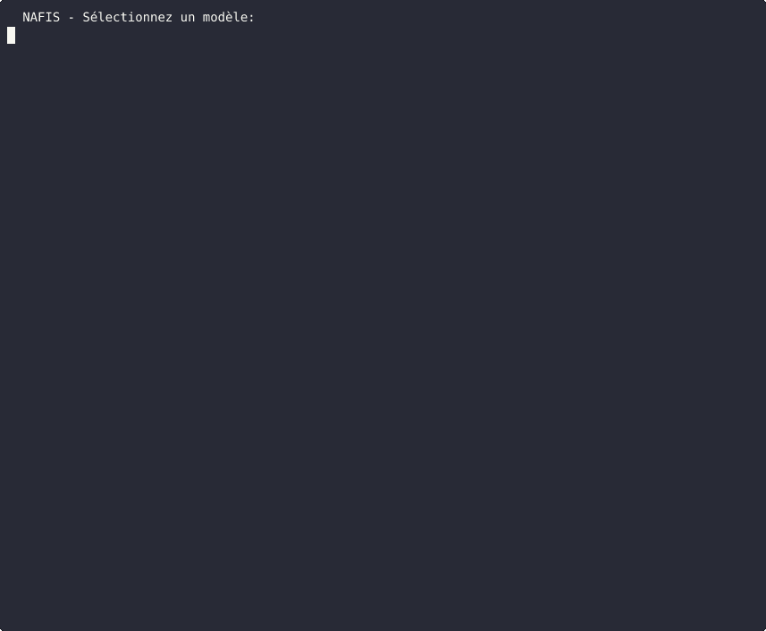

<h1 align="center">NAFIS & AI Sandbox</h1>

<p align="center">
  
</p>


> **NAFIS** — CLI multi-modèles IA avec intégration sandbox QEMU  
> **AI Sandbox** — Environnement d'exécution isolé pour code Python, Node.js et GCC sous QEMU/KVM

---

## Table des matières

- [Présentation](#présentation)
- [Architecture](#architecture)
- [Prérequis](#prérequis)
- [Installation](#installation)
  - [Option A — Hôte Alpine Linux](#option-a--hôte-alpine-linux)
  - [Option B — Hôte Ubuntu/Debian](#option-b--hôte-ubuntudebian)
- [Utilisation de NAFIS](#utilisation-de-nafis)
- [Utilisation du Sandbox](#utilisation-du-sandbox)
  - [Mode Daemon (persistant)](#mode-daemon-persistant)
  - [Mode Cold Start (one-shot)](#mode-cold-start-one-shot)
  - [API REST](#api-rest)
- [Commandes disponibles](#commandes-disponibles)
- [Dépannage](#dépannage)
- [Licence](#licence)

---

## Présentation

Ce dépôt fournit deux outils complémentaires :

| Outil | Description |
|-------|-------------|
| **NAFIS** | Interface en ligne de commande pour interroger plusieurs modèles IA (via Ollama) avec exécution automatique du code généré dans un sandbox sécurisé. |
| **AI Sandbox** | Machine virtuelle légère sous QEMU utilisant un initramfs custom et le partage 9p pour exécuter du code Python, Node.js ou GCC en isolation totale. |

### Fonctionnalités clés

- 🧠 **Multi-modèles** : MiMo-7B, Qwen Coder, CodeQwen, DeepSeek Coder
- 🔒 **Exécution isolée** : Chaque snippet de code s'exécute dans une VM QEMU dédiée
- ⚡ **Mode Daemon** : VM persistante avec polling 8 ms et locks fichier pour latence minimale
- 🔄 **Mode Cold** : VM one-shot pour exécution sans état
- 🌐 **API REST** : Endpoint `/execute` et `/health` accessibles sur le port 9999
- 🖥️ **SSH intégré** : Accès direct à la VM via port forwarding (mode Ubuntu)
- 💾 **Disque persistant** : Stockage qcow2 de 2 Go pour données durables (mode Ubuntu)

---

## Architecture

```
┌─────────────────────────────────────────────────────────────┐
│                         HÔTE                                │
│  ┌─────────────┐    ┌─────────────┐    ┌─────────────┐      │
│  │   NAFIS     │──▶│   Bridge    │───▶│  VM QEMU    │      │
│  │   (CLI)     │    │  (Flask)    │    │  (Alpine)   │      │
│  └─────────────┘    │   :9999     │    │             │      │
│                     └─────────────┘    │  ┌───────┐  │      │
│                          │             │  │ Agent │  │      │
│                          ▼             │  │Daemon │  │      │
│                    9p (virtio) ──────▶│  │Python │  │      │
│                                        │  └───────┘  │      │
│                                        └─────────────┘      │
└─────────────────────────────────────────────────────────────┘
```

---

## Prérequis

### Matériel

- Processeur x86_64 avec support virtualisation (VT-x/AMD-V)
- 2 Go de RAM minimum (4 Go recommandés)
- 5 Go d'espace disque disponible

### Système

- **Alpine Linux** 3.18+ (Option A)
- **Ubuntu** 22.04+ ou **Debian** 12+ (Option B)
- Accès root obligatoire

### Dépendances communes

| Paquet | Alpine | Ubuntu/Debian |
|--------|--------|---------------|
| QEMU | `qemu-system-x86_64` | `qemu-system-x86` |
| Python 3 | `python3` | `python3` |
| Flask / CORS | `py3-flask` + `pip3 flask-cors` | `pip3 flask flask-cors` |
| Outils | `cpio`, `curl`, `busybox` | `cpio`, `curl`, `busybox-static` |

> **Note KVM** : Le script détecte automatiquement `/dev/kvm` et active l'accélération matérielle si disponible.

---

## Installation

### Option A — Hôte Alpine Linux

Le script `setup_sandbox_Alpine.sh` construit un environnement complet depuis le kernel `linux-virt` d'Alpine.

```bash
# 1. Cloner le dépôt
git clone https://github.com/cyber-lombard-web-services/_-.git
cd _-

# 2. Exécuter le setup (root obligatoire)
sudo su
chmod +x setup_sandbox_Alpine.sh
./setup_sandbox_Alpine.sh
```

**Ce que fait le script :**

1. Vérifie et installe les dépendances (`qemu-system-x86_64`, `python3`, `flask-cors`, etc.)
2. Extrait le kernel virt et les modules 9p depuis `/boot`
3. Construit un initramfs custom avec Busybox, Python 3 et les agents
4. Crée le **Bridge Flask** (API REST sur port 9999)
5. Crée le **VM Manager** (démarrage/arrêt de la VM)
6. Installe les wrappers globaux (`sandbox-start`, `sandbox-stop`, etc.)
7. Installe la commande `nafis`

**Fichiers générés dans `/root/ai_sandbox/` :**

```
/root/ai_sandbox/
├── vmlinuz              # Kernel Alpine virt
├── initrd.img           # Initramfs custom (agents inclus)
├── bridge.py            # Serveur Flask API
├── vm_manager.sh        # Gestionnaire de VM
├── start.sh             # Démarrage complet
├── stop.sh              # Arrêt complet
├── status.sh            # État du système
├── restart.sh           # Redémarrage
├── test.sh              # Test de performance
├── debug.sh             # Diagnostic
├── logs/                # Logs QEMU et bridge
└── .daemon_mode         # Flag mode persistant
```

### Option B — Hôte Ubuntu/Debian

Le script `setup_sandbox_Ubuntu.sh` télécharge une ISO Alpine virt et construit un environnement enrichi avec Node.js et GCC.

```bash
# 1. Cloner le dépôt
git clone https://github.com/cyber-lombard-web-services/_-.git
cd _-

# 2. Exécuter le setup (root obligatoire)
sudo su
chmod +x setup_sandbox_Ubuntu.sh
./setup_sandbox_Ubuntu.sh
```

**Différences majeures avec la version Alpine :**

| Fonctionnalité | Alpine | Ubuntu |
|----------------|--------|--------|
| Source kernel | `/boot/vmlinuz-virt` existant | Téléchargement ISO Alpine |
| Modules | Extraction depuis `/lib/modules` | Extraction depuis modloop ISO |
| Disque persistant | Non | Oui (`disk.qcow2`, 2 Go) |
| Réseau VM | Local uniquement | NAT + SSH (port 2222) |
| Compilateurs | Python uniquement | Python + Node.js + GCC |
| RAM allouée | 1024 Mo | 2048 Mo |

**Fichiers générés dans `/root/ai_sandbox/` :**

```
/root/ai_sandbox/
├── vmlinuz              # Kernel extrait de l'ISO
├── initrd.img           # Initramfs custom
├── modloop-virt         # Modloop Alpine (source modules)
├── disk.qcow2           # Disque persistant 2 Go
├── bridge.py            # Serveur Flask API
├── vm_manager.sh        # Gestionnaire de VM
├── start.sh             # Démarrage complet
├── stop.sh              # Arrêt complet
├── test.sh              # Test rapide
├── debug.sh             # Diagnostic
└── logs/                # Logs QEMU
```

---

## Utilisation de NAFIS

NAFIS est une interface CLI qui se connecte à Ollama (port 11434) et au Sandbox (port 9999).

### Prérequis NAFIS

Assurez-vous qu'Ollama est installé et en cours d'exécution :

```bash
# Installation Ollama (si nécessaire)
curl -fsSL https://ollama.com/install.sh | sh
ollama serve &

# Télécharger un modèle (exemple)
ollama pull qwen2.5-coder:3b
```

### Lancer NAFIS

```bash
nafis
```

### Interface interactive

```
🤖 NAFIS - Sélectionnez un modèle:
  [1] MiMo-7B
  [2] Qwen Coder 3B
  [3] CodeQwen
  [4] DeepSeek Coder

Choix [1-4] (défaut: 2): 2

✅ Modèle: Qwen Coder 3B
Commandes: /exit, /model, /run <code>, /sandbox
--------------------------------------------------

>>> Écris un script Python qui calcule les n premiers nombres premiers

⚡ Génération...

📝 Voici un script Python pour calculer les nombres premiers :

```python
def premiers(n):
    ...
```

🔧 Sandbox:
[2, 3, 5, 7, 11, 13, 17, 19, 23]
```

### Commandes spéciales

| Commande | Description |
|----------|-------------|
| `/exit` | Quitter NAFIS |
| `/model` | Changer de modèle IA |
| `/run <code>` | Exécuter du code Python directement dans le sandbox |
| `/sandbox` | Vérifier l'état du sandbox |

---

## Utilisation du Sandbox

### Démarrage rapide

```bash
# Démarrer le sandbox (VM + Bridge API)
sandbox-start

# Ou depuis le répertoire
cd /root/ai_sandbox
./start.sh
```

Le terminal affichera :

```
=========================================
AI SANDBOX v78.0 - Démarrage
=========================================
✅ Agent prêt après 3s

Bridge API sur http://localhost:9999
Ctrl+C pour arrêter
=========================================
```

### Mode Daemon (persistant)

C'est le mode par défaut. La VM reste en mémoire et répond aux requêtes via l'API.

**Caractéristiques :**
- VM QEMU persistante avec agent Python en arrière-plan
- Communication par polling fichier (8 ms) avec locks
- Latence typique : 10–50 ms par requête
- Idéal pour NAFIS et les appels API fréquents

### Mode Cold Start (one-shot)

Pour une exécution unique sans VM persistante :

```bash
# Désactiver le mode daemon
rm -f /root/ai_sandbox/.daemon_mode

# Le bridge lancera une VM temporaire par requête
python3 /root/ai_sandbox/bridge.py
```

**Caractéristiques :**
- Une VM est créée et détruite pour chaque requête
- Latence : 2–5 s par requête (boot VM inclus)
- Aucun état persistant entre les exécutions
- Utile pour les environnements à ressources limitées

### API REST

#### `POST /execute`

Exécute du code Python dans le sandbox.

**Requête :**

```bash
curl -X POST http://localhost:9999/execute   -H "Content-Type: application/json"   -d '{
    "code": "print(2+2)"
  }'
```

**Réponse (mode daemon) :**

```json
{
  "success": true,
  "execution_id": "a1b2c3",
  "output": "4",
  "duration": 0.042,
  "mode": "daemon"
}
```

**Réponse (mode cold) :**

```json
{
  "success": true,
  "output": "4",
  "duration": 2.341,
  "mode": "cold"
}
```

#### `GET /health`

Vérification de l'état du système.

```bash
curl http://localhost:9999/health
```

**Réponse :**

```json
{
  "status": "ok",
  "mode": "daemon",
  "agent_ready": true,
  "version": "v78.0"
}
```

---

## Commandes disponibles

### Wrappers globaux (disponibles dans tout le shell)

| Commande | Description |
|----------|-------------|
| `sandbox-start` | Démarre la VM et le bridge Flask |
| `sandbox-stop` | Arrête la VM et le bridge |
| `sandbox-status` | Affiche l'état de la VM et du bridge |
| `sandbox-restart` | Redémarrage complet |
| `sandbox-test` | Envoie 3 requêtes de test et affiche les résultats |
| `sandbox-debug` | Diagnostic complet (logs, processus, test API) |

### Scripts locaux (dans `/root/ai_sandbox/`)

```bash
cd /root/ai_sandbox

./start.sh      # Démarrage interactif (Ctrl+C pour arrêter)
./stop.sh       # Arrêt propre
./status.sh     # État détaillé
./restart.sh    # Redémarrage
./test.sh       # Test de performance
./debug.sh      # Mode diagnostic
```

### Gestion manuelle de la VM

```bash
# Démarrer uniquement la VM (sans bridge)
./vm_manager.sh start

# Arrêter la VM
./vm_manager.sh stop

# Vérifier l'état
./vm_manager.sh status
```

---

## Dépannage

### La VM ne démarre pas

```bash
# Vérifier KVM
ls -la /dev/kvm
# Si absent : modprobe kvm_intel ou modprobe kvm_amd

# Vérifier les logs
sudo tail -50 /root/ai_sandbox/logs/vm_daemon.log

# Debug complet
sandbox-debug
```

### L'agent n'est pas prêt

```bash
# Vérifier le fichier ready
cat /root/ai_sandbox/agent_ready

# Redémarrer proprement
sandbox-stop
sleep 2
sandbox-start
```

### Timeout sur les requêtes API

```bash
# Vérifier que le bridge écoute
sudo netstat -tlnp | grep 9999

# Test direct
curl -X POST http://localhost:9999/execute   -H "Content-Type: application/json"   -d '{"code":"print(1)"}'
```

### Ollama non accessible depuis NAFIS

```bash
# Vérifier le service Ollama
curl http://localhost:11434/api/tags

# Si vide, démarrer Ollama
ollama serve &
```

### Réinstallation propre

```bash
# Arrêter tout
sandbox-stop
pkill -f qemu
pkill -f bridge
pkill -f python3

# Supprimer et recréer
rm -rf /root/ai_sandbox
# Relancer le script de setup
./setup_sandbox_Alpine.sh  # ou Ubuntu.sh
```

---

## Licence

```
AI Sandbox & NAFIS
Copyright © 2026 Thibaut Lombard — Tous droits réservés

Ce logiciel est propriétaire. Toute reproduction, distribution ou modification
sans autorisation écrite préalable est interdite.
```

---

<p align="center">
  <b>NAFIS</b> — *Next AI For Intelligent Scripts*<br>
  <b>AI Sandbox</b> — *Exécution isolée, performance maximale*
</p>
